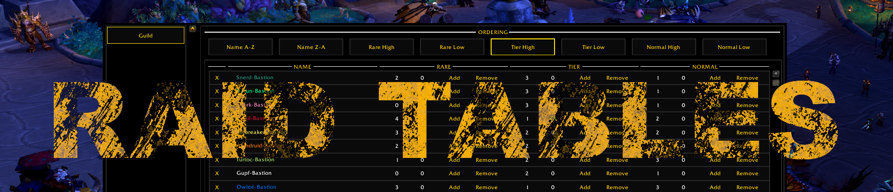
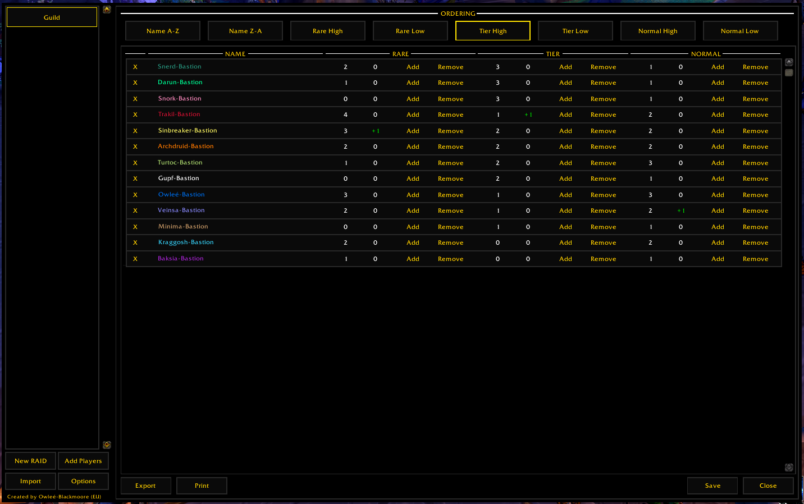
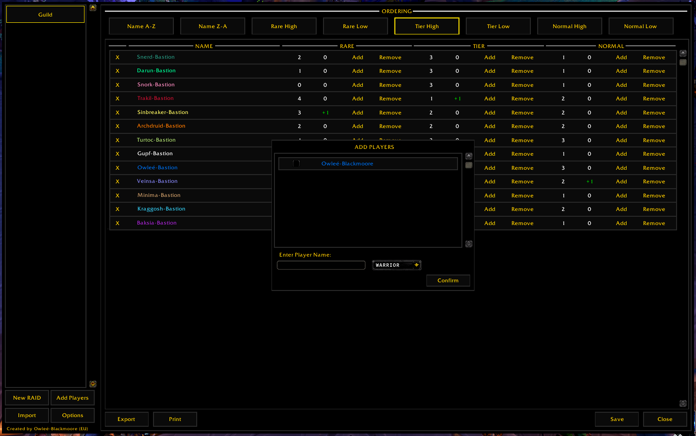
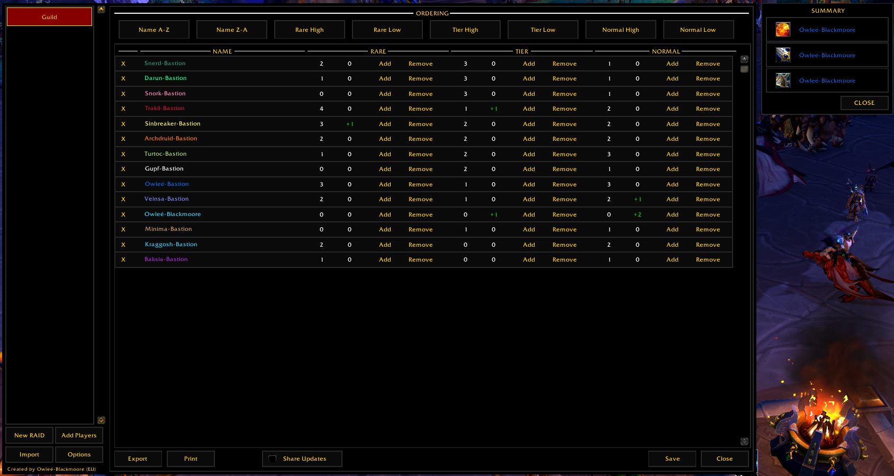

---

---

# Raid Tables
This is an addon for the [World of Warcraft](www.worldofwarcraft.com) game by Blizzard Entertainment. It provides an unique way to handle loot distribution in the raid context of the game. It is used in my personal raiding guild and tries to fix issues with personal loot and other common loot distribution schemes. It categorizes loot in three categories - rare, tier and normal - and ranks players based on the item count a player already received in the past. The player with the highest roll for a item in a category and the lowest item count, gets the loot (of course exceptions are possible and can be manually assigned). This way we lower the dependence on pure luck by each player (as in personal loot) and distribute items more fairly.

It was initially created by me so that I don't have to have access to Excel or use services like Google Docs. Instead everything can be handled ingame and the addon automates nearly everything. If other raiders are using [Raid Tables Viewer](https://github.com/TumbleOwlee/raid-tables-viewer) they can also get live updates and get the list of all assignments done by the raid leader instantly. This way it provides full transperancy.

## Functionality

The following functionalities are implemented:
* Create a new raid setup (unlimited number of raids can be created)
* Add players to a raid setup
* Import and export a raid setup
* Print full table in text mode to distribute it in text channels (e.g. Discord)
* Provide interface to easily distribute raid loot
  - Start and stop of roll for an item
  - Assign loot to players automatically (or manually)
  - Show list of all assigned items with the winning player
* Automatically share changes and loot assignments with [Raid Tables Viewer](https://github.com/TumbleOwlee/raid-tables-viewer) users

## UI Impressions

    <h2 align="center">Raid Overview</h2>
    

    <h2 align="center">Add Players Dialog</h2>
    

    <h2 align="center">Loot Assignment Dialog</h2>
    

    <h2 align="center">Loot Summary Dialog</h2>
    

