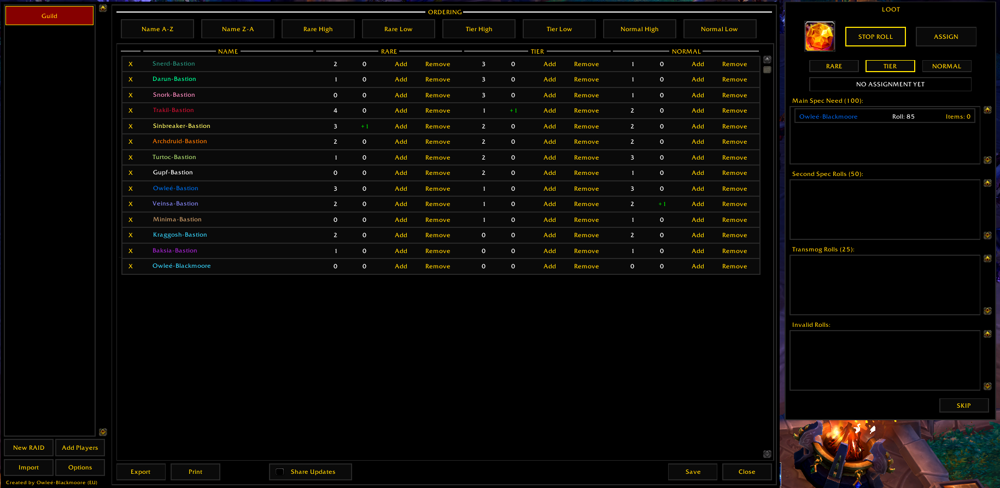

---

---

# Raid Tables
This is an addon for the [World of Warcraft](www.worldofwarcraft.com) game by Blizzard Entertainment. It provides an unique way to handle loot distribution in the raid context of the game. It is used in my personal raiding guild and tries to fix issues with personal loot and other common loot distribution schemes. It categorizes loot in three categories - rare, tier and normal - and ranks players based on the item count a player already received in the past. The player with the highest roll for a item in a category and the lowest item count, gets the loot (of course exceptions are possible and can be manually assigned). This way we lower the dependence on pure luck by each player (as in personal loot) and distribute items more fairly.

It was initially created by me so that I don't have to have access to Excel or use services like Google Docs. Instead everything can be handled ingame and the addon automates nearly everything. If other raiders are using [Raid Tables Viewer](https://github.com/TumbleOwlee/raid-tables-viewer) they can also get live updates and get the list of all assignments done by the raid leader instantly. This way it provides full transperancy.

## Functionality

The following functionalities are implemented:
* Create a new raid setup (unlimited number of raids can be created)
* Add players to a raid setup
* Import and export a raid setup
* Print full table in text mode to distribute it in text channels (e.g. Discord)
* Provide interface to easily distribute raid loot
  - Start and stop of roll for an item
  - Assign loot to players automatically (or manually)
  - Show list of all assigned items with the winning player
* Automatically share changes and loot assignments with [Raid Tables Viewer](https://github.com/TumbleOwlee/raid-tables-viewer) users

## UI Impressions

    <h2 align="center">Raid Overview</h2>
    

This is the default view if you toggle the addon frame. On the left side, you'll find the list of all created raid compositions. If you have any composition selected, the details are shown on the right side. On the top you have buttons to reorder the table. In the center the table is shown. Each player can be removed by clicking the `X` on the left. From left to right, each column - rare, tier and normal - consist of the saved item count, the change to apply with save, the add button to increase and the remove button the reduce the item count. The add and remove buttons are only used if you want to manually overwrite the statistics. Normally everything is done automatically and you only have to click `Save` to apply the changes.

    <h2 align="center">Add Players Dialog</h2>
    

This dialog gives you the option to add additional players to your raid setup. By default, all players of your group/raid that aren't already part of your setup will be listed. You can use the toggle to select them. If you want to manually add a player, you can use the input field. Make sure to select the class in the dropdown menu. It's used for correct colorization of the name label.

    <h2 align="center">Loot Assignment Dialog</h2>
    

If any loot if open for roll, the loot assignment dialog will be shown. At the top left, you'll see the item. Clicking `Start Roll` will print a message containing the item link to your group/raid channel to notify everyone to roll. The tier, rare and normal buttons are used to specify the type of loot. Normally the correct button will be selected by default. The determination is based on the item identifiers specified in the settings.

If any player rolled 100, 50, 25 or any other value, the player including the roll value will be shown in the corresponding list. On the right side of the player is the item count a player has already received in the selected category. Clicking on a player will select it for assignment. Finally if you have selected a player and click `ASSIGN`, the item will be added to the player's count and either the loot assignment dialog of the next item or the summary frame is shown.

    <h2 align="center">Loot Summary Dialog</h2>
    

After assigning all items to a player, the summary frame is shown. It will list all items with the corresponding player name. If you previously skipped an item, the item will not be listed. Only items will be listed, that have to be traded.
